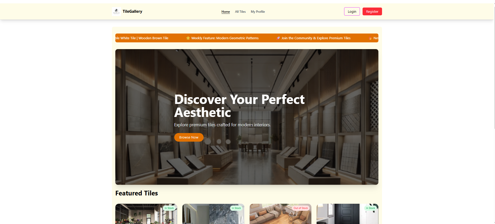

# 🧱 Tiles Gallery

## 📌 Project Overview

**Tiles Gallery** is a modern and responsive web application built with **Next.js** that showcases a collection of aesthetic tiles in an elegant and user-friendly interface. Users can browse, search, and explore tile details while enjoying a fast, responsive, and visually appealing experience powered by modern web technologies.

---

## 🌐 Live Links

- **Live Site:** https://tiles-gallery-five.vercel.app/
- **GitHub Repository:** https://github.com/yeasinarafatraihan42511-blip/tiles-gallery

---

## 📸 Project Screenshot

> Home Page Preview



---

## 🎯 Purpose

The primary goal of this project is to build a modern tile gallery platform that demonstrates responsive web design, authentication, protected routes, dynamic routing, and clean UI/UX using Next.js and MongoDB.

---

## ✨ Core Features

- 🔍 Search tiles by title
- 🧱 Browse all tiles in a responsive gallery layout
- 📄 View detailed information for each tile
- 🔐 Secure Authentication (Email/Password & Google Login)
- 👤 User Profile with update functionality
- 🚫 Protected Routes for authorized users
- 📱 Fully Responsive Design (Desktop, Tablet & Mobile)
- ⚡ Fast rendering using Next.js App Router
- 🔄 Loading spinner while fetching data
- ❌ Custom 404 Not Found Page
- 🎞️ Animated Banner and Marquee Section
- 🎨 Clean, modern and user-friendly interface

---

## 🛠️ Technologies Used

### Frontend

- Next.js (App Router)
- React.js
- JavaScript (ES6+)
- Tailwind CSS
- HeroUI

### Backend

- BetterAuth

### Database

- MongoDB

### Deployment

- Vercel

---

## 🔐 Authentication Features

- Email & Password Registration
- Secure Login System
- Google Social Login
- Session Management
- Protected Routes
- Automatic Redirect after Login & Logout

---

## 🚦 Route Permissions

| Route | Access |
|--------|--------|
| / | Public |
| /all-tiles | Public |
| /login | Public |
| /register | Public |
| /tile/[id] | Private |
| /my-profile | Private |

---

## 🎨 UI Highlights

- Modern Responsive Navbar
- Hero Banner with Image Slider
- Animated Marquee Section
- Beautiful Tile Cards
- Smooth Hover Effects
- Clean Typography
- Responsive Footer
- Attractive Color Palette

---

## 📦 Dependencies

- next
- react
- react-dom
- @heroui/react
- better-auth
- mongoose
- tailwindcss
- postcss
- autoprefixer

---

## 🚀 Run the Project Locally

### 1️⃣ Clone the Repository

```bash
git clone https://github.com/yeasinarafatraihan42511-blip/tiles-gallery.git
```

### 2️⃣ Navigate to the Project Folder

```bash
cd tiles-gallery
```

### 3️⃣ Install Dependencies

```bash
npm install
```

### 4️⃣ Configure Environment Variables

Create a `.env.local` file in the root directory and add the required environment variables.

```env
MONGODB_URI=your_mongodb_connection_string
BETTER_AUTH_SECRET=your_secret_key
BETTER_AUTH_URL=http://localhost:3000
GOOGLE_CLIENT_ID=your_google_client_id
GOOGLE_CLIENT_SECRET=your_google_client_secret
```

### 5️⃣ Start the Development Server

```bash
npm run dev
```

Open your browser and visit:

```text
http://localhost:3000
```

---

## 📂 Project Structure

- Home Page
- All Tiles Page
- Tile Details Page
- Login & Registration
- User Profile
- Protected Routes
- Custom 404 Page

---

## 📢 Final Notes

This project was developed following modern web development best practices and fulfills the assignment requirements, including:

- ✅ Responsive Design
- ✅ Authentication System
- ✅ Protected Routes
- ✅ Dynamic Routing
- ✅ Modern UI/UX
- ✅ MongoDB Integration
- ✅ Deployment Ready
- ✅ Clean & Organized Code Structure

---

## 👨‍💻 Developer

**Yeasin Arafat**

- 📧 Email: yeasinarafatraihan42511@gmail.com
- 💼 LinkedIn: www.linkedin.com/in/
yeasin-arafat-raihan
- 🐙 GitHub: https://github.com/yeasinarafatraihan42511-blip

---

## ⭐ Acknowledgements

Thank you for visiting this repository. If you find this project helpful, feel free to give it a ⭐ on GitHub. Your feedback and suggestions are always appreciated.
